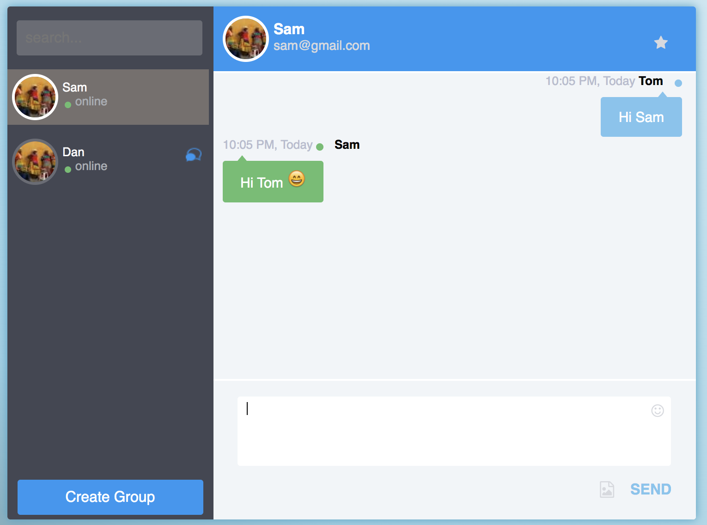

# Whatsis

Anonymous chat application.

## Access application at

https://whatsis-v1.herokuapp.com/

# How to you

For login, you can use any username and email (email does not have to be a vaild one).
Once you logged in, you will see following screen.

On left hand side you can see number of online people.

You can start chating with anyone. Once you do that, you will see the following screen.

## Create Group

You can also create a group. Click on `Create Group` (left bottom) and then do the following
1. Give your group a name.
2. Add participants (All participants will get notification that you have added them to a group) 

Once done. You can start chating in a group.

## Note

If you refresh, all your chat history will be deleted. But, if you had logged in with your personal email (gmail only), you will get chat backup as part of email.
